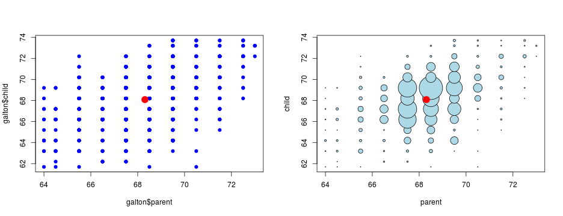
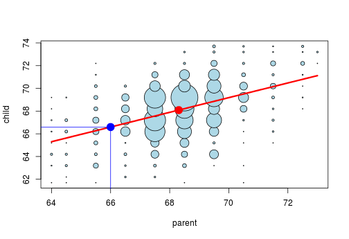

## Galton's Data

1. The Data set from tabulated data set used by Galton in 1885 to study the relationship between a parent's height and their childrens.
2. This data is used to predict childrens' height from their parents' height.
3. There is a correction for gender via multiplying female heights by 1.08.

```r
library(UsingR); data(galton);
names(galton)
```

```
## [1] "child"  "parent"
```

```r
dim(galton)
```

```
## [1] 928   2
```


--- .class #4 

## Comparing children's heights and their parents' heights
 
* Size of point in figure 2 represents number of points at that (X, Y) combination.
* Red point are mean value of two variable.

---  .class #5 
## Use the simple linear regression to fit a line 

```r
fit <- lm(child ~ parent,data=galton);
fit$coefficients
```

```
## (Intercept)      parent 
##  23.9415302   0.6462906
```
 

---  .class #6
## Predict children's height from parents' height

```r
parent_height <- 66
prediction <- predict(fit, newdata = data.frame(parent=c(parent_height)))
prediction[[1]]
```

```
## [1] 66.59671
```

 
